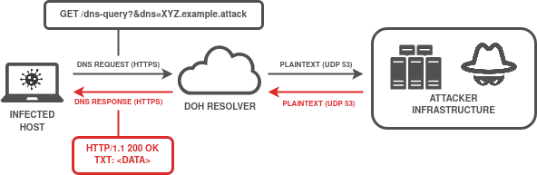

# DoH Tunneling Dataset
[](https://en.wikipedia.org/wiki/MIT_License)
[](https://github.com/Korving-F/doh-tunnel-dataset)

## Table of Contents
* [Introduction](#introduction)
* [MITRE ATT&CK](#mitre-attck)
* [Scenario](#scenario)
* [Consume Datasets](#consume-datasets)
* [Architecture](#architecture)
* [Detection Rules](#detection-rules)
* [Datasets](#datasets)
    * [File transfer over DoH Tunnel](#file-transfer-over-doh-tunnel)
    * [C2 over DoH Tunnel](#c2-over-doh-tunnel)
* [License](#license)

## Introduction
This repository documents a DNS tunneling over DoH scenario written in [DACA](https://github.com/Korving-F/DACA/) configuration language and the generated datasets it creates.
Samples can be used for detection tuning or for educational purposes.

This dataset was created as part of Master thesis work at [TalTech](https://taltech.ee/).

To reproduce the generated datasets, follow these instructions:
```bash
# 1. Install Vagrant and VirtualBox

# 2. Install Vagrant modules
vagrant plugin install vagrant-vbguest
vagrant plugin install vagrant-scp

# 3A Start and stop the VMs of a single dataset, data collection will follow automatically.
cd directory/with/Vagrantfile
vagrant up
vagrant halt

# 3B Alternatively generate and run and recreate all datasets in the scenario.
pip3 install pipenv
git clone git@github.com:Korving-F/DACA.git
cd DACA
pipenv install

python3 daca.py run -d data/ --path /path/to/scenario_file.yaml
```

## MITRE ATT&CK
* [C2 Application Layer Protocol: DNS - T1071.004](https://attack.mitre.org/techniques/T1071/004/)
* [C2 Protocol Tunneling - T1572](https://attack.mitre.org/techniques/T1572/)
* [Exfiltration Over Alternative Protocol - T1048](https://attack.mitre.org/techniques/T1048/)

## Scenario
Used DNS Tunneling software: [IODINE](https://github.com/yarrick/iodine) / [DNS2TCP](https://github.com/alex-sector/dns2tcp) / [DNSTT](https://www.bamsoftware.com/software/dnstt/)

Used DoH Server/Client: [DNS-over-HTTPS](https://github.com/m13253/dns-over-https) with [NGINX](http://hg.nginx.org/nginx/) as a TLS termination proxy.

## Consume Datasets
Collected data within this repository comes in a variety of formats:
* .log  - Flatfiles containing query logs as produced by the DoH Server and Webserver.
* .json - Same flatfiles but then relayed by Filebeat. This allows for post-hoc ingestion into an elasticsearch cluster.
* .cast - [asciinema](https://asciinema.org/) recordings of attacker's perspective. Replay by issuing: `asciinema play *.cast`.
* .pcap - Standard packet capture looking at traffic on ports:
    * UDP 53 - DNS traffic from DoH proxy to tunnel server
    * TCP 443 - DoH HTTPS traffic from client to DoH server
    * TCP 8053 - HTTP after TLS termination

Two additional directories can be found:
* suricata - Contains [Suricata](https://suricata.io/) logs produced from the pcap.</br> See also `suricata-logging.bash` and `suricata.yaml`.
* ja3      - Exported JA3 signatures using a [Wireshark JA3 plugin](https://github.com/fullylegit/ja3).</br> See also the following commands and/or the two `ja3` scripts placed in the root of this repository.
    ```bash
    tshark -r filename.pcap -Y tls.handshake.type==1 -T fields -e ja3.hash
    tshark -r filename.pcap -Y tls.handshake.type==2 -T fields -e ja3s.hash
    ```

## Architecture

> **Fig 1:** DNS Tunnel over DoH high-level overview. Encoded/encrypted DNS queries establish a communications channel over HTTPS.
</br>  
</br>  


> **Fig 2:** Overview on how the DNS Tunnels over DoH are simulated and allow for C2 / data transfers.
</br>  
</br>  


> **Fig 3:** Runthrough of the VM Creation, Provisioning, Data Generation and Acquisition process using IaC / DevOps tooling.
</br>  


## Datasets
### File transfer over DoH Tunnel
#### IODINE
| DOH SERVER | AUTOMATION LEVEL | DNS RECORD TYPE | ENCODING | PASSPHRASE | LINK | DATA LINK | 
| ------------- | ------------- | ------------- | ------------- | ------------- | ------------- | ------------- |
| DNS-over-HTTPS | Fully Automated | CNAME | BASE64 | 0xDEADBEEF | [Scenario files](doh_tunnel_file_transfer/fcfefbf7ed7d6070a9607a06d0588d1a) | [Data files](doh_tunnel_file_transfer/fcfefbf7ed7d6070a9607a06d0588d1a/fcfefbf7ed7d6070a9607a06d0588d1a_full_dataset.tar.gz) | 
| DNS-over-HTTPS | Fully Automated | CNAME | RAW | 0xDEADBEEF | [Scenario files](doh_tunnel_file_transfer/5ff127b33415fc41dc88eed627345b57) | [Data files](doh_tunnel_file_transfer/5ff127b33415fc41dc88eed627345b57/5ff127b33415fc41dc88eed627345b57_full_dataset.tar.gz) | 
| DNS-over-HTTPS | Fully Automated | CNAME | BASE32 | 0xDEADBEEF | [Scenario files](doh_tunnel_file_transfer/86d08c97be237f2d72d2630ec680cb90) | [Data files](doh_tunnel_file_transfer/86d08c97be237f2d72d2630ec680cb90/86d08c97be237f2d72d2630ec680cb90_full_dataset.tar.gz) | 
| DNS-over-HTTPS | Fully Automated | CNAME | BASE128 | 0xDEADBEEF | [Scenario files](doh_tunnel_file_transfer/594c188dead4329a636f2954467fb40f) | [Data files](doh_tunnel_file_transfer/594c188dead4329a636f2954467fb40f/594c188dead4329a636f2954467fb40f_full_dataset.tar.gz) | 
| DNS-over-HTTPS | Fully Automated | MX | BASE128 | 0xDEADBEEF | [Scenario files](doh_tunnel_file_transfer/40f4e85538f5673bb2e7353dba4335c2) | [Data files](doh_tunnel_file_transfer/40f4e85538f5673bb2e7353dba4335c2/40f4e85538f5673bb2e7353dba4335c2_full_dataset.tar.gz) | 
| DNS-over-HTTPS | Fully Automated | MX | BASE64 | 0xDEADBEEF | [Scenario files](doh_tunnel_file_transfer/9e8afcd9e4366e28e3e936f9b8c1ec8d) | [Data files](doh_tunnel_file_transfer/9e8afcd9e4366e28e3e936f9b8c1ec8d/9e8afcd9e4366e28e3e936f9b8c1ec8d_full_dataset.tar.gz) | 
| DNS-over-HTTPS | Fully Automated | MX | BASE32 | 0xDEADBEEF | [Scenario files](doh_tunnel_file_transfer/a1f15d21910020a2bc4dcd1aed7a9577) | [Data files](doh_tunnel_file_transfer/a1f15d21910020a2bc4dcd1aed7a9577/a1f15d21910020a2bc4dcd1aed7a9577_full_dataset.tar.gz) | 
| DNS-over-HTTPS | Fully Automated | MX | RAW | 0xDEADBEEF | [Scenario files](doh_tunnel_file_transfer/090a2cd0129c8747c362063e2c5d8640) | [Data files](doh_tunnel_file_transfer/090a2cd0129c8747c362063e2c5d8640/090a2cd0129c8747c362063e2c5d8640_full_dataset.tar.gz) | 
| DNS-over-HTTPS | Fully Automated | NULL | RAW | 0xDEADBEEF | [Scenario files](doh_tunnel_file_transfer/4d2fb05553a463a564197e03d7ab9ef6) | [Data files](doh_tunnel_file_transfer/4d2fb05553a463a564197e03d7ab9ef6/4d2fb05553a463a564197e03d7ab9ef6_full_dataset.tar.gz) | 
| DNS-over-HTTPS | Fully Automated | NULL | BASE64 | 0xDEADBEEF | [Scenario files](doh_tunnel_file_transfer/3b45778421b6253d3995f79320d469ee) | [Data files](doh_tunnel_file_transfer/3b45778421b6253d3995f79320d469ee/3b45778421b6253d3995f79320d469ee_full_dataset.tar.gz) | 
| DNS-over-HTTPS | Fully Automated | NULL | BASE32 | 0xDEADBEEF | [Scenario files](doh_tunnel_file_transfer/5a98c1483b4e3f7688c25e8369a41492) | [Data files](doh_tunnel_file_transfer/5a98c1483b4e3f7688c25e8369a41492/5a98c1483b4e3f7688c25e8369a41492_full_dataset.tar.gz) | 
| DNS-over-HTTPS | Fully Automated | NULL | BASE128 | 0xDEADBEEF | [Scenario files](doh_tunnel_file_transfer/9b43b140ca734728dbb6155c7ed1bf2e) | [Data files](doh_tunnel_file_transfer/9b43b140ca734728dbb6155c7ed1bf2e/9b43b140ca734728dbb6155c7ed1bf2e_full_dataset.tar.gz) | 
| DNS-over-HTTPS | Fully Automated | PRIVATE | RAW | 0xDEADBEEF | [Scenario files](doh_tunnel_file_transfer/c1eb27d85d5fda5af505afba5d4e4299) | [Data files](doh_tunnel_file_transfer/c1eb27d85d5fda5af505afba5d4e4299/c1eb27d85d5fda5af505afba5d4e4299_full_dataset.tar.gz) | 
| DNS-over-HTTPS | Fully Automated | PRIVATE | BASE128 | 0xDEADBEEF | [Scenario files](doh_tunnel_file_transfer/4c99673934f75a13d8e7d69edde51648) | [Data files](doh_tunnel_file_transfer/4c99673934f75a13d8e7d69edde51648/4c99673934f75a13d8e7d69edde51648_full_dataset.tar.gz) | 
| DNS-over-HTTPS | Fully Automated | PRIVATE | BASE64 | 0xDEADBEEF | [Scenario files](doh_tunnel_file_transfer/23a0a5a8e47264591dde38c5eeacda0f) | [Data files](doh_tunnel_file_transfer/23a0a5a8e47264591dde38c5eeacda0f/23a0a5a8e47264591dde38c5eeacda0f_full_dataset.tar.gz) | 
| DNS-over-HTTPS | Fully Automated | PRIVATE | BASE32 | 0xDEADBEEF | [Scenario files](doh_tunnel_file_transfer/e5af6780e45da6f9f6b30fafa53548da) | [Data files](doh_tunnel_file_transfer/e5af6780e45da6f9f6b30fafa53548da/e5af6780e45da6f9f6b30fafa53548da_full_dataset.tar.gz) | 
| DNS-over-HTTPS | Fully Automated | SRV | RAW | 0xDEADBEEF | [Scenario files](doh_tunnel_file_transfer/80658059380748bb8e4c605167cb0238) | [Data files](doh_tunnel_file_transfer/80658059380748bb8e4c605167cb0238/80658059380748bb8e4c605167cb0238_full_dataset.tar.gz) | 
| DNS-over-HTTPS | Fully Automated | SRV | BASE32 | 0xDEADBEEF | [Scenario files](doh_tunnel_file_transfer/6b9605dd137ab1cdf6fe1a15888ff0d0) | [Data files](doh_tunnel_file_transfer/6b9605dd137ab1cdf6fe1a15888ff0d0/6b9605dd137ab1cdf6fe1a15888ff0d0_full_dataset.tar.gz) | 
| DNS-over-HTTPS | Fully Automated | SRV | BASE128 | 0xDEADBEEF | [Scenario files](doh_tunnel_file_transfer/00152ec818040f261f9fc8ba9a026392) | [Data files](doh_tunnel_file_transfer/00152ec818040f261f9fc8ba9a026392/00152ec818040f261f9fc8ba9a026392_full_dataset.tar.gz) | 
| DNS-over-HTTPS | Fully Automated | SRV | BASE64 | 0xDEADBEEF | [Scenario files](doh_tunnel_file_transfer/834290a2620dd89a5a0a5bcb2513fadc) | [Data files](doh_tunnel_file_transfer/834290a2620dd89a5a0a5bcb2513fadc/834290a2620dd89a5a0a5bcb2513fadc_full_dataset.tar.gz) | 
| DNS-over-HTTPS | Fully Automated | TXT | BASE32 | 0xDEADBEEF | [Scenario files](doh_tunnel_file_transfer/70b653665ed80f5e3c113619390956b7) | [Data files](doh_tunnel_file_transfer/70b653665ed80f5e3c113619390956b7/70b653665ed80f5e3c113619390956b7_full_dataset.tar.gz) | 
| DNS-over-HTTPS | Fully Automated | TXT | BASE128 | 0xDEADBEEF | [Scenario files](doh_tunnel_file_transfer/971e7470ef0619c6ccaab7b7045598bd) | [Data files](doh_tunnel_file_transfer/971e7470ef0619c6ccaab7b7045598bd/971e7470ef0619c6ccaab7b7045598bd_full_dataset.tar.gz) | 
| DNS-over-HTTPS | Fully Automated | TXT | RAW | 0xDEADBEEF | [Scenario files](doh_tunnel_file_transfer/a93495160abbcb48956aa031a5b49181) | [Data files](doh_tunnel_file_transfer/a93495160abbcb48956aa031a5b49181/a93495160abbcb48956aa031a5b49181_full_dataset.tar.gz) | 
| DNS-over-HTTPS | Fully Automated | TXT | BASE64 | 0xDEADBEEF | [Scenario files](doh_tunnel_file_transfer/a6f0d9cba13cd123cd9a81e3e9b3a0e3) | [Data files](doh_tunnel_file_transfer/a6f0d9cba13cd123cd9a81e3e9b3a0e3/a6f0d9cba13cd123cd9a81e3e9b3a0e3_full_dataset.tar.gz) | 


#### DNS2TCP
| DOH SERVER | AUTOMATION LEVEL | DNS RECORD TYPE | COMPRESSION | PASSPHRASE | LINK | DATA LINK | 
| ------------- | ------------- | ------------- | ------------- | ------------- | ------------- | ------------- |
| DNS-over-HTTPS | Fully Automated | KEY | YES | 0xDEADBEEF | [Scenario files](doh_tunnel_file_transfer/afc3bce01fc430c13eace2370412dd09) | [Data files](doh_tunnel_file_transfer/afc3bce01fc430c13eace2370412dd09/afc3bce01fc430c13eace2370412dd09_full_dataset.tar.gz) | 
| DNS-over-HTTPS | Fully Automated | KEY | NO | 0xDEADBEEF | [Scenario files](doh_tunnel_file_transfer/8f7bd466629bfbe4e8367ee09ca120bb) | [Data files](doh_tunnel_file_transfer/8f7bd466629bfbe4e8367ee09ca120bb/8f7bd466629bfbe4e8367ee09ca120bb_full_dataset.tar.gz) | 
| DNS-over-HTTPS | Fully Automated | TXT | YES | 0xDEADBEEF | [Scenario files](doh_tunnel_file_transfer/07fc006e04538c903a70e3d78c8f6593) | [Data files](doh_tunnel_file_transfer/07fc006e04538c903a70e3d78c8f6593/07fc006e04538c903a70e3d78c8f6593_full_dataset.tar.gz) | 
| DNS-over-HTTPS | Fully Automated | TXT | NO | 0xDEADBEEF | [Scenario files](doh_tunnel_file_transfer/09ed5bf4696cdca87fbce5f811eded67) | [Data files](doh_tunnel_file_transfer/09ed5bf4696cdca87fbce5f811eded67/09ed5bf4696cdca87fbce5f811eded67_full_dataset.tar.gz) | 


#### DNSTT
| DOH SERVER | AUTOMATION LEVEL | TLS FINGERPRINT | LINK | DATA LINK | 
| ------------- | ------------- | ------------- | ------------- | ------------- |
| DNS-over-HTTPS | Fully Automated | Chrome | [Scenario files](doh_tunnel_file_transfer/601736c56a18195d7536f92f603f6e11) | [Data files](doh_tunnel_file_transfer/601736c56a18195d7536f92f603f6e11/601736c56a18195d7536f92f603f6e11_full_dataset.tar.gz) | 
| DNS-over-HTTPS | Fully Automated | Chrome_58 | [Scenario files](doh_tunnel_file_transfer/72bd1c3d4e2824c7b51cdddd01b95cd8) | [Data files](doh_tunnel_file_transfer/72bd1c3d4e2824c7b51cdddd01b95cd8/72bd1c3d4e2824c7b51cdddd01b95cd8_full_dataset.tar.gz) | 
| DNS-over-HTTPS | Fully Automated | Chrome_62 | [Scenario files](doh_tunnel_file_transfer/0d645f768e617005f270beb124fd9c37) | [Data files](doh_tunnel_file_transfer/0d645f768e617005f270beb124fd9c37/0d645f768e617005f270beb124fd9c37_full_dataset.tar.gz) | 
| DNS-over-HTTPS | Fully Automated | Chrome_70 | [Scenario files](doh_tunnel_file_transfer/27073e5ef5295f9cb05075b91732ed48) | [Data files](doh_tunnel_file_transfer/27073e5ef5295f9cb05075b91732ed48/27073e5ef5295f9cb05075b91732ed48_full_dataset.tar.gz) | 
| DNS-over-HTTPS | Fully Automated | Chrome_72 | [Scenario files](doh_tunnel_file_transfer/43db8367b26cf7151170cfd00f07649f) | [Data files](doh_tunnel_file_transfer/43db8367b26cf7151170cfd00f07649f/43db8367b26cf7151170cfd00f07649f_full_dataset.tar.gz) | 
| DNS-over-HTTPS | Fully Automated | Chrome_83 | [Scenario files](doh_tunnel_file_transfer/a9cecfe347c32976d6695040d5507244) | [Data files](doh_tunnel_file_transfer/a9cecfe347c32976d6695040d5507244/a9cecfe347c32976d6695040d5507244_full_dataset.tar.gz) | 
| DNS-over-HTTPS | Fully Automated | Firefox | [Scenario files](doh_tunnel_file_transfer/9e7ec92b8ced0335cd8472414b8e5c53) | [Data files](doh_tunnel_file_transfer/9e7ec92b8ced0335cd8472414b8e5c53/9e7ec92b8ced0335cd8472414b8e5c53_full_dataset.tar.gz) | 
| DNS-over-HTTPS | Fully Automated | Firefox_55 | [Scenario files](doh_tunnel_file_transfer/381d04b19e0b027a035ae331a237e281) | [Data files](doh_tunnel_file_transfer/381d04b19e0b027a035ae331a237e281/381d04b19e0b027a035ae331a237e281_full_dataset.tar.gz) | 
| DNS-over-HTTPS | Fully Automated | Firefox_56 | [Scenario files](doh_tunnel_file_transfer/362e24f751a70a7058d089ddd8a1f59c) | [Data files](doh_tunnel_file_transfer/362e24f751a70a7058d089ddd8a1f59c/362e24f751a70a7058d089ddd8a1f59c_full_dataset.tar.gz) | 
| DNS-over-HTTPS | Fully Automated | Firefox_63 | [Scenario files](doh_tunnel_file_transfer/6464492684ca7247e8bbda6a4ea2639d) | [Data files](doh_tunnel_file_transfer/6464492684ca7247e8bbda6a4ea2639d/6464492684ca7247e8bbda6a4ea2639d_full_dataset.tar.gz) | 
| DNS-over-HTTPS | Fully Automated | Firefox_65 | [Scenario files](doh_tunnel_file_transfer/02ad546118ba4e6f1603b1566916e3dd) | [Data files](doh_tunnel_file_transfer/02ad546118ba4e6f1603b1566916e3dd/02ad546118ba4e6f1603b1566916e3dd_full_dataset.tar.gz) | 
| DNS-over-HTTPS | Fully Automated | iOS | [Scenario files](doh_tunnel_file_transfer/a4bcb6c6a79e2b5b1e3a72572bc72ae5) | [Data files](doh_tunnel_file_transfer/a4bcb6c6a79e2b5b1e3a72572bc72ae5/a4bcb6c6a79e2b5b1e3a72572bc72ae5_full_dataset.tar.gz) | 
| DNS-over-HTTPS | Fully Automated | iOS_11_1 | [Scenario files](doh_tunnel_file_transfer/524fcd163afb5676be86c8e65c1a0484) | [Data files](doh_tunnel_file_transfer/524fcd163afb5676be86c8e65c1a0484/524fcd163afb5676be86c8e65c1a0484_full_dataset.tar.gz) | 
| DNS-over-HTTPS | Fully Automated | iOS_12_1 | [Scenario files](doh_tunnel_file_transfer/2b91047c0ae0dc94721581241a16ef0a) | [Data files](doh_tunnel_file_transfer/2b91047c0ae0dc94721581241a16ef0a/2b91047c0ae0dc94721581241a16ef0a_full_dataset.tar.gz) | 
| DNS-over-HTTPS | Fully Automated | none | [Scenario files](doh_tunnel_file_transfer/c2bf27dbb4c152508713a9d1414e973c) | [Data files](doh_tunnel_file_transfer/c2bf27dbb4c152508713a9d1414e973c/c2bf27dbb4c152508713a9d1414e973c_full_dataset.tar.gz) | 


### C2 over DoH Tunnel
#### DNS2TCP
| DOH SERVER | AUTOMATION LEVEL | DNS RECORD TYPE | COMPRESSION | PASSPHRASE | LINK | DATA LINK | 
| ------------- | ------------- | ------------- | ------------- | ------------- | ------------- | ------------- |
| DNS-over-HTTPS | Partly Manual | KEY | NO | 0xDEADBEEF | [Scenario files](doh_tunnel_c2/114d3f4082ae9fd03576fbd5b73b40e4) | [Data files](doh_tunnel_c2/114d3f4082ae9fd03576fbd5b73b40e4/114d3f4082ae9fd03576fbd5b73b40e4_full_dataset.tar.gz) | 
| DNS-over-HTTPS | Partly Manual | KEY | YES | 0xDEADBEEF | [Scenario files](doh_tunnel_c2/45f56049a5c5659303c72fa38d3aae80) | [Data files](doh_tunnel_c2/45f56049a5c5659303c72fa38d3aae80/45f56049a5c5659303c72fa38d3aae80_full_dataset.tar.gz) | 
| DNS-over-HTTPS | Partly Manual | TXT | YES | 0xDEADBEEF | [Scenario files](doh_tunnel_c2/177c88133b0fa9350ce7158fe21d07ec) | [Data files](doh_tunnel_c2/177c88133b0fa9350ce7158fe21d07ec/177c88133b0fa9350ce7158fe21d07ec_full_dataset.tar.gz) | 
| DNS-over-HTTPS | Partly Manual | TXT | NO | 0xDEADBEEF | [Scenario files](doh_tunnel_c2/484cbc429999a4a16da99b04ac2f6c13) | [Data files](doh_tunnel_c2/484cbc429999a4a16da99b04ac2f6c13/484cbc429999a4a16da99b04ac2f6c13_full_dataset.tar.gz) | 


#### DNSTT
| DOH SERVER | AUTOMATION LEVEL | TLS FINGERPRINT | LINK | DATA LINK | 
| ------------- | ------------- | ------------- | ------------- | ------------- |
| DNS-over-HTTPS | Partly Manual | Chrome | [Scenario files](doh_tunnel_c2/8644ce3360128f05c2927498070d8265) | [Data files](doh_tunnel_c2/8644ce3360128f05c2927498070d8265/8644ce3360128f05c2927498070d8265_full_dataset.tar.gz) | 
| DNS-over-HTTPS | Partly Manual | Chrome_58 | [Scenario files](doh_tunnel_c2/4827236d70d8fd799452fe4d41301b97) | [Data files](doh_tunnel_c2/4827236d70d8fd799452fe4d41301b97/4827236d70d8fd799452fe4d41301b97_full_dataset.tar.gz) | 
| DNS-over-HTTPS | Partly Manual | Chrome_62 | [Scenario files](doh_tunnel_c2/c4ef1f0d838a4e8bab4646442a3cf03b) | [Data files](doh_tunnel_c2/c4ef1f0d838a4e8bab4646442a3cf03b/c4ef1f0d838a4e8bab4646442a3cf03b_full_dataset.tar.gz) | 
| DNS-over-HTTPS | Partly Manual | Chrome_70 | [Scenario files](doh_tunnel_c2/a825de7ec054b955246658676232800d) | [Data files](doh_tunnel_c2/a825de7ec054b955246658676232800d/a825de7ec054b955246658676232800d_full_dataset.tar.gz) | 
| DNS-over-HTTPS | Partly Manual | Chrome_72 | [Scenario files](doh_tunnel_c2/8c17458a49126158cd9177ee0d1bfc03) | [Data files](doh_tunnel_c2/8c17458a49126158cd9177ee0d1bfc03/8c17458a49126158cd9177ee0d1bfc03_full_dataset.tar.gz) | 
| DNS-over-HTTPS | Partly Manual | Chrome_83 | [Scenario files](doh_tunnel_c2/0b04bdc87563f4909dcf819e299473e0) | [Data files](doh_tunnel_c2/0b04bdc87563f4909dcf819e299473e0/0b04bdc87563f4909dcf819e299473e0_full_dataset.tar.gz) | 
| DNS-over-HTTPS | Partly Manual | Firefox | [Scenario files](doh_tunnel_c2/68c58a06f47716371dd3a039dabe84f9) | [Data files](doh_tunnel_c2/68c58a06f47716371dd3a039dabe84f9/68c58a06f47716371dd3a039dabe84f9_full_dataset.tar.gz) | 
| DNS-over-HTTPS | Partly Manual | Firefox_55 | [Scenario files](doh_tunnel_c2/39f1cdc9e2556db70a78aa74251c7287) | [Data files](doh_tunnel_c2/39f1cdc9e2556db70a78aa74251c7287/39f1cdc9e2556db70a78aa74251c7287_full_dataset.tar.gz) | 
| DNS-over-HTTPS | Partly Manual | Firefox_56 | [Scenario files](doh_tunnel_c2/d45bf0c92090eea25b919fb5afb800fe) | [Data files](doh_tunnel_c2/d45bf0c92090eea25b919fb5afb800fe/d45bf0c92090eea25b919fb5afb800fe_full_dataset.tar.gz) | 
| DNS-over-HTTPS | Partly Manual | Firefox_63 | [Scenario files](doh_tunnel_c2/ab777a56e4795bb1c37aec62f9074997) | [Data files](doh_tunnel_c2/ab777a56e4795bb1c37aec62f9074997/ab777a56e4795bb1c37aec62f9074997_full_dataset.tar.gz) | 
| DNS-over-HTTPS | Partly Manual | Firefox_65 | [Scenario files](doh_tunnel_c2/47e7b02a9e0026d4f62c108be3801469) | [Data files](doh_tunnel_c2/47e7b02a9e0026d4f62c108be3801469/47e7b02a9e0026d4f62c108be3801469_full_dataset.tar.gz) | 
| DNS-over-HTTPS | Partly Manual | iOS | [Scenario files](doh_tunnel_c2/64b9dc0ceedb7bfc1a6c8522184123e9) | [Data files](doh_tunnel_c2/64b9dc0ceedb7bfc1a6c8522184123e9/64b9dc0ceedb7bfc1a6c8522184123e9_full_dataset.tar.gz) | 
| DNS-over-HTTPS | Partly Manual | iOS_11_1 | [Scenario files](doh_tunnel_c2/935e20487c54018a59e61948be831c11) | [Data files](doh_tunnel_c2/935e20487c54018a59e61948be831c11/935e20487c54018a59e61948be831c11_full_dataset.tar.gz) | 
| DNS-over-HTTPS | Partly Manual | iOS_12_1 | [Scenario files](doh_tunnel_c2/bb9d14d36d96d8ed86953de91b500a4e) | [Data files](doh_tunnel_c2/bb9d14d36d96d8ed86953de91b500a4e/bb9d14d36d96d8ed86953de91b500a4e_full_dataset.tar.gz) | 
| DNS-over-HTTPS | Partly Manual | none | [Scenario files](doh_tunnel_c2/539af3311e676a4c596d3199ede4d01b) | [Data files](doh_tunnel_c2/539af3311e676a4c596d3199ede4d01b/539af3311e676a4c596d3199ede4d01b_full_dataset.tar.gz) | 


## License
> DACA is licensed under the [MIT](#) license.
> Copyright &copy; 2022, Frank Korving
    