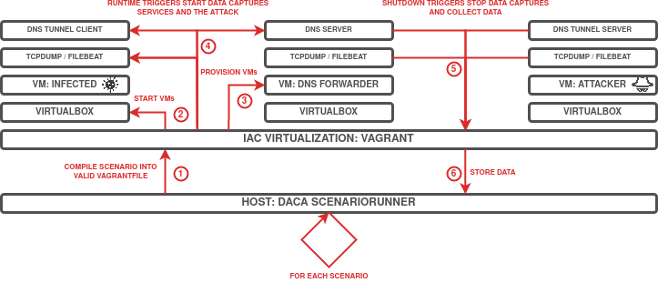

# DoH Tunneling Dataset
[](https://en.wikipedia.org/wiki/MIT_License)
[](https://github.com/Korving-F/doh-tunnel-dataset)

## Table of Contents
* [Introduction](#introduction)
* [MITRE ATT&CK](#mitre-attck)
* [Scenario](#scenario)
* [Consume Datasets](#consume-datasets)
* [Architecture](#architecture)
* [Detection Rules](#detection-rules)
* [Datasets](#datasets)
    * [File transfer over DNS Tunnel](#file-transfer-over-dns-tunnel)
    * [C2 over DNS Tunnel](#c2-over-dns-tunnel)
* [License](#license)

## Introduction
This repository documents a DNS tunneling over DoH scenario written in [DACA](https://github.com/Korving-F/DACA/) configuration language and the generated datasets it creates.
Samples can be used for detection tuning or for educational purposes.

This dataset was created as part of Master thesis work at [TalTech](https://taltech.ee/).

To reproduce the generated datasets, follow these instructions:
```bash
# 1. Install Vagrant and VirtualBox

# 2. Install Vagrant modules
vagrant plugin install vagrant-vbguest
vagrant plugin install vagrant-scp

# 3A Start and stop the VMs of a single dataset, data collection will follow automatically.
cd directory/with/Vagrantfile
vagrant up
vagrant halt

# 3B Alternatively generate and run and recreate all datasets in the scenario.
pip3 install pipenv
git clone git@github.com:Korving-F/DACA.git
cd DACA
pipenv install

python3 daca.py run -d data/ --path /path/to/scenario_file.yaml
```

## MITRE ATT&CK
* [C2 Application Layer Protocol: DNS - T1071.004](https://attack.mitre.org/techniques/T1071/004/)
* [C2 Protocol Tunneling - T1572](https://attack.mitre.org/techniques/T1572/)
* [Exfiltration Over Alternative Protocol - T1048](https://attack.mitre.org/techniques/T1048/)

## Scenario
Used DNS Tunneling software: [IODINE](https://github.com/yarrick/iodine) / [DNS2TCP](https://github.com/alex-sector/dns2tcp) / [DNSTT](https://www.bamsoftware.com/software/dnstt/)

Used DoH Server/Client: [DNS-over-HTTPS](https://github.com/m13253/dns-over-https) with [NGINX](http://hg.nginx.org/nginx/) as a TLS termination proxy.

## Consume Datasets
Collected data within this repository comes in a variety of formats:
* .log  - Flatfiles containing query logs as produced by the DoH Server and Webserver.
* .json - Same flatfiles but then relayed by Filebeat. This allows for post-hoc ingestion into an elasticsearch cluster.
* .cast - [asciinema](https://asciinema.org/) recordings of attacker's perspective. Replay by issuing: `asciinema play *.cast`.
* .pcap - Standard packet capture looking at traffic on ports 53 (UDP DNS from DoH proxy to tunnel server), port 443 (TCP DoH HTTPS traffic from client to DoH server) and port 8053 (TCP HTTP after TLS termination).

Two additional directories can be found:
* suricata - Contains [Suricata](https://suricata.io/) logs produced from the pcap. See also `suricata-logging.bash` and `suricata.yaml`.
* ja3      - Exported JA3 signatures using [Wireshark's JA3 plugin](https://github.com/fullylegit/ja3).</br> See also the following commands and/or the two `ja3` scripts placed in the root of this repository.
    ```bash
    tshark -r filename.pcap -Y tls.handshake.type==1 -T fields -e ja3.hash
    tshark -r filename.pcap -Y tls.handshake.type==2 -T fields -e ja3s.hash
    ```

## Architecture

> **Fig 1:** DNS Tunnel high-level overview. Encoded/encrypted DNS queries establish a communications channel.
</br>  
</br>  


> **Fig 2:** Overview on how the DNS Tunnels are simulated and allow for C2 / data transfers.
</br>  
</br>  


> **Fig 3:** Runthrough of the VM Creation, Provisioning, Data Generation and Acquisition process using IaC / DevOps tooling.
</br>  


## Datasets
### File transfer over DNS Tunnel
#### IODINE
| DNS SERVER | AUTOMATION LEVEL | DNS RECORD TYPE | ENCODING | PASSPHRASE | LINK | DATA LINK | 
| ------------- | ------------- | ------------- | ------------- | ------------- | ------------- | ------------- |


#### DNS2TCP
| DNS SERVER | AUTOMATION LEVEL | DNS RECORD TYPE | COMPRESSION | PASSPHRASE | LINK | DATA LINK | 
| ------------- | ------------- | ------------- | ------------- | ------------- | ------------- | ------------- |


#### DNSCAT
| DNS SERVER | AUTOMATION LEVEL | DNS RECORD TYPE | LINK | DATA LINK | 
| ------------- | ------------- | ------------- | ------------- | ------------- |


### C2 over DNS Tunnel
#### DNS2TCP
| DNS SERVER | AUTOMATION LEVEL | DNS RECORD TYPE | COMPRESSION | PASSPHRASE | LINK | DATA LINK | 
| ------------- | ------------- | ------------- | ------------- | ------------- | ------------- | ------------- |


#### DNSCAT
| DNS SERVER | AUTOMATION LEVEL | DNS RECORD TYPE | LINK | DATA LINK | 
| ------------- | ------------- | ------------- | ------------- | ------------- |


## License
> DACA is licensed under the [MIT](#) license.
> Copyright &copy; 2022, Frank Korving
    